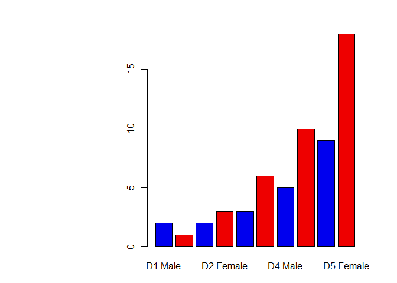

Lecture 5 Hands-On
================
Daniel Nguyen
January 22nd, 2019

``` r
#Class 5 - R Graphics Intro


#First Boxplot
x <- rnorm(1000,0)
boxplot(x)
```


``` r
summary(x)
```

    ##     Min.  1st Qu.   Median     Mean  3rd Qu.     Max. 
    ## -2.97562 -0.74794 -0.04502 -0.07955  0.64759  3.55310

``` r
hist(x)
```


``` r
#2A
weight <- read.table("bimm143_05_rstats/bimm143_05_rstats/weight_chart.txt", header = TRUE, sep = "")
plot(weight, type="b", pch=15, cex=1.5, lwd=2, ylim=c(2,10), xlab="Age (months)", ylab="Weight (kg)", main="Baby weight with age")
```


``` r
#2B
feat <- read.table("bimm143_05_rstats/bimm143_05_rstats/feature_counts.txt", header = TRUE, sep="\t")
par(mar=c(3, 13.0, 3, 3))
barplot(feat$Count, horiz = TRUE, xlim= c(0,80000), names.arg = feat$Feature, main="Number of features in the ouse GRCm38 genome", las=1)
```


``` r
#2C
hist(c(rnorm(10000), rnorm(10000)+4), breaks = 100)
```


``` r
#3A
MFcount <- read.table("bimm143_05_rstats/bimm143_05_rstats/male_female_counts.txt", header = TRUE, sep = "\t")
barplot(MFcount$Count, names.arg=MFcount$Sample, col = rainbow(nrow(MFcount)))
```


``` r
barplot(MFcount$Count, names.arg=MFcount$Sample, col = c("blue2", "red2"))
```



``` r
#3B
genes <- read.table("bimm143_05_rstats/bimm143_05_rstats/up_down_expression.txt", header = TRUE, sep = "\t")
table(genes$State)
```

    ## 
    ##       down unchanging         up 
    ##         72       4997        127

``` r
par(mar=c(6,6,3,3))
plot(genes$Condition1, genes$Condition2, xlab="Expression Condition 1", ylab="Expression Condition 2", col=genes$State)
```


``` r
palette(c("red","gray","blue"))
plot(genes$Condition1, genes$Condition2, xlab="Expression Condition 1", ylab="Expression Condition 2", col=genes$State)
```


``` r
#3C
meth <- read.table("bimm143_05_rstats/bimm143_05_rstats/expression_methylation.txt", header = TRUE, sep="\t")
plot(meth$gene.meth, meth$expression)
```


``` r
ColorDensity <- densCols(meth$gene.meth, meth$expression)
plot(meth$gene.meth, meth$expression, col=ColorDensity, pch=20)
```


``` r
index = meth$expression > 0
ColorDensity <- densCols(meth$gene.meth[index], meth$expression[index])
plot(meth$gene.meth[index], meth$expression [index], col=ColorDensity, pch=20)
```


``` r
ColorDensity <- densCols(meth$gene.meth[index], meth$expression[index], colramp=colorRampPalette(c("blue", "green","red","yellow")))
plot(meth$gene.meth[index], meth$expression [index], col=ColorDensity, pch=20)
```


``` r
#4A
```
